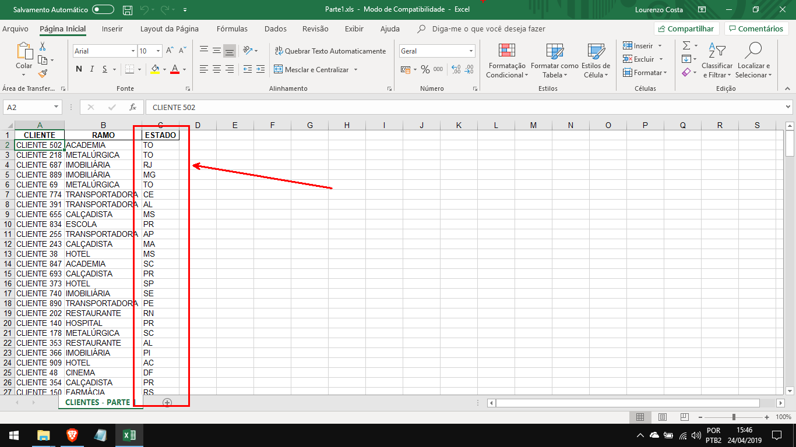
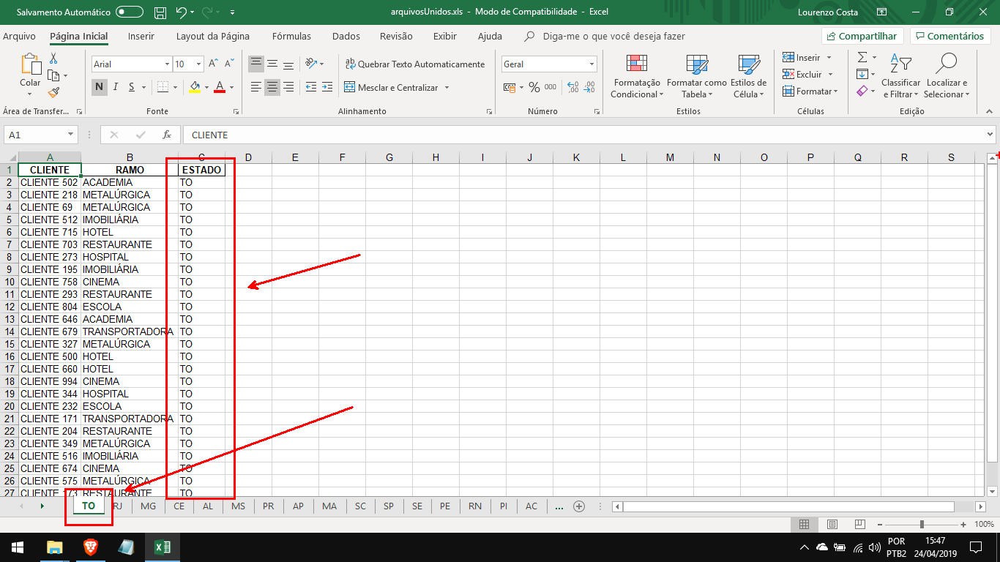

# Excel merger
Merge MS Excel files grouped by sheets according to a chosen collumm.

To install the requirements using pip, run the following at the command-line:
```
pip install -r requirements.txt
```
### Demonstration
[Click here to watch a video](https://vimeo.com/282215720)
## Screenshots
#### Input file

### Output file

